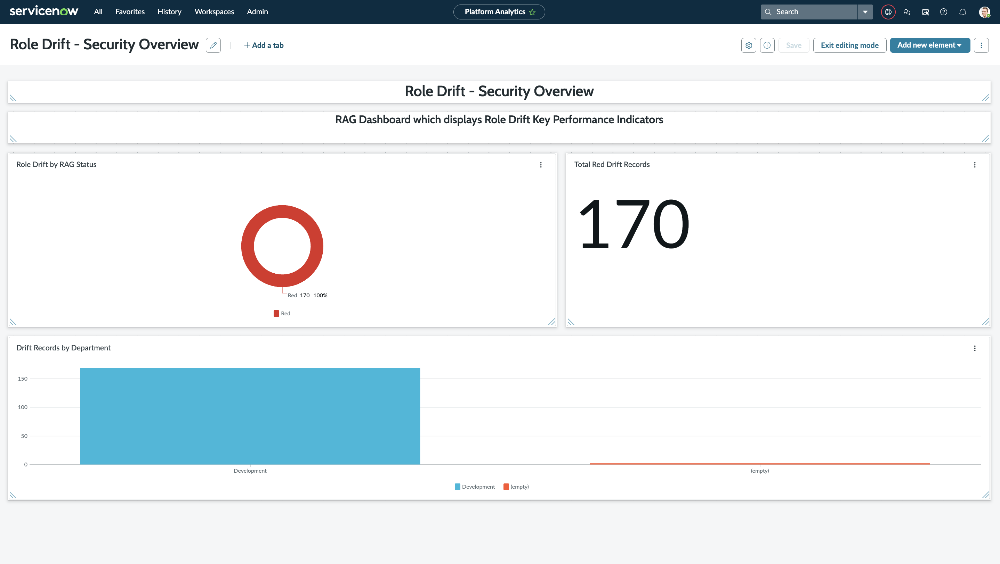
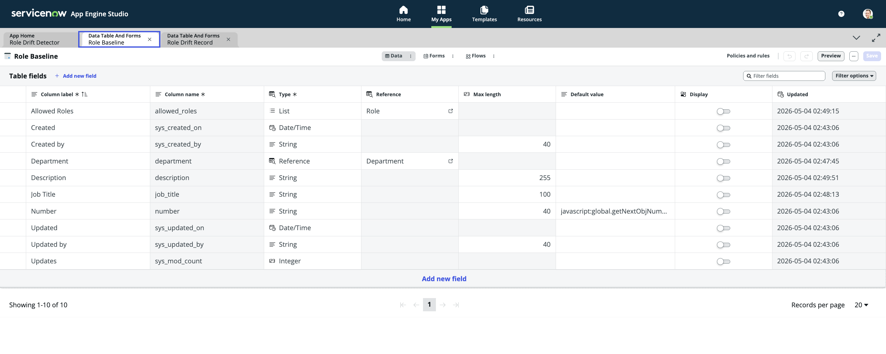
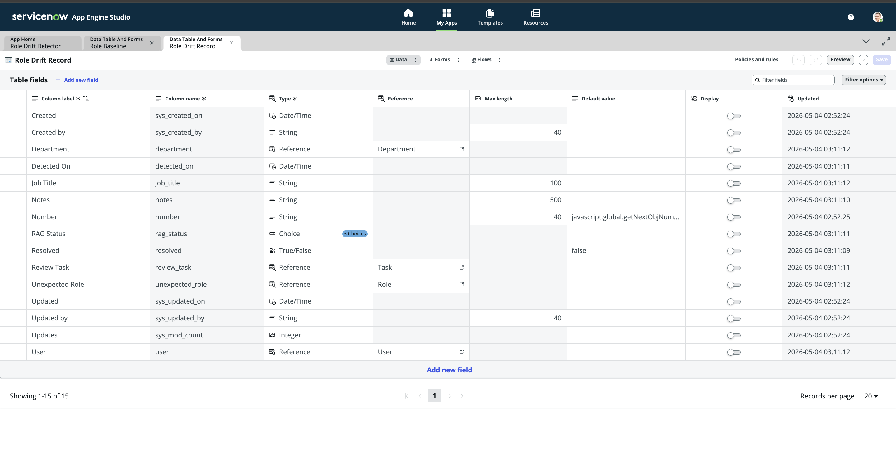
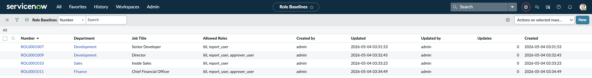
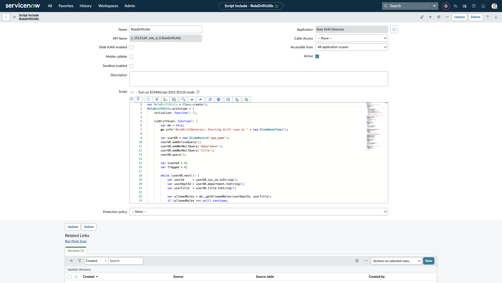
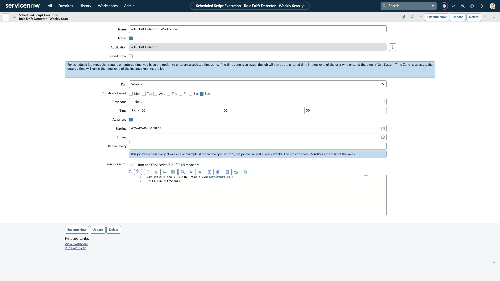
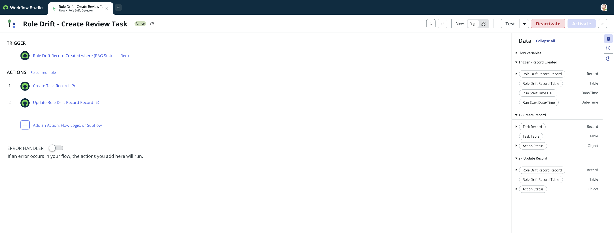

# 🔐 Role Drift Detector — ServiceNow Scoped App
 
> A proactive security tool that detects and flags unauthorised role accumulation (role drift) in ServiceNow environments — one of the most common findings in IT security audits.
 

 
---
 
## 🚨 The Problem
 
In ServiceNow environments, users accumulate roles over time — a project grant here, an emergency access there — and nobody revokes them. This is called **role drift** and it is one of the most common findings in IT security audits.
 
ServiceNow has no native tool that proactively catches it. Organisations only discover the problem when an auditor flags it or a breach happens. **Every organisation running ServiceNow has this problem right now.**
 
---
 
## ✅ What This App Does
 
The Role Drift Detector is a scoped ServiceNow application with three core components:
 
1. **Role Baseline Table** — Defines the expected role set per job title and department
2. **Weekly Detection Script** — Compares every active user's actual roles against their expected baseline and flags any deviation as a "drift record"
3. **Security Dashboard** — RAG status per user: 🟢 Green (clean), 🟡 Amber (review needed), 🔴 Red (immediate action required)
Flagged users automatically generate a High priority review task assigned to the security team.
 
---
 
## 🛠 Tech Stack
 
| Component | Technology |
|---|---|
| App Framework | ServiceNow Scoped App (App Engine Studio) |
| Data Layer | Custom GlideRecord Tables |
| Detection Engine | Server-side Script Include (GlideRecord) |
| Scheduling | Scheduled Script Execution |
| Automation | Flow Designer |
| Visualisation | Platform Analytics Dashboard |
 
---
 
## 🏗 Architecture
 
```
┌─────────────────────────────────────────────────────┐
│                  Weekly Scheduled Job                │
│           (Runs every Sunday at midnight)            │
└─────────────────────┬───────────────────────────────┘
                      │ calls
                      ▼
┌─────────────────────────────────────────────────────┐
│              RoleDriftUtils (Script Include)         │
│                                                     │
│  1. Query all active users with dept + title        │
│  2. Look up Role Baseline for each user             │
│  3. Compare actual roles vs allowed roles           │
│  4. Create drift record for each unexpected role    │
│  5. Calculate RAG status (Amber < 7 days, Red ≥ 7) │
└─────────────────────┬───────────────────────────────┘
                      │ creates
                      ▼
┌─────────────────────────────────────────────────────┐
│            Role Drift Record (Custom Table)         │
│   User | Unexpected Role | RAG Status | Resolved    │
└─────────────────────┬───────────────────────────────┘
                      │ triggers (if Red)
                      ▼
┌─────────────────────────────────────────────────────┐
│         Flow Designer: Create Review Task           │
│   → Creates High priority Task                      │
│   → Links Task back to Drift Record                 │
└─────────────────────────────────────────────────────┘
``` 
---
 
## 🚀 Installation
 
This app was built directly on a ServiceNow PDI using App Engine Studio. These are the steps that I took to create the project.
 
### Step 1 — Create the Scoped App
1. Navigate to App Engine Studio
2. Create new app: **Role Drift Detector**
3. Note your scope prefix (e.g. `x_1515169_role_d_0`)
### Step 2 — Create Custom Tables
 
**Table 1: Role Baseline** (`x_[scope]_role_baseline`)
 
| Field | Type | Reference |
|---|---|---|
| Department | Reference | cmn_department |
| Job Title | String (100) | — |
| Allowed Roles | List | sys_user_role |
| Description | String (255) | — |


 
**Table 2: Role Drift Record** (`x_[scope]_role_drift_record`)
 
| Field | Type | Reference |
|---|---|---|
| User | Reference | sys_user |
| Unexpected Role | Reference | sys_user_role |
| Department | Reference | cmn_department |
| Job Title | String (100) | — |
| RAG Status | Choice | green / amber / red |
| Detected On | Date/Time | — |
| Resolved | True/False | default: false |
| Review Task | Reference | task |
| Notes | String (500) | — |

 
---
 
## ⚙️ Configuration
 
### Populate Role Baselines
 
Navigate to `x_[scope]_role_baseline.list` and create one record per department/job title combination.
 
Example baselines:
 
| Department | Job Title | Allowed Roles |
|---|---|---|
| Development | Senior Developer | itil, report_user |
| Development | Director | itil, report_user, approver_user |
| Sales | Inside Sales | itil, report_user |
| Finance | Chief Financial Officer | itil, report_user, approver_user |

Defines the expected roles for each department and job title combination.


 
---
 
## 🔍 How It Works
 
The detection engine (`RoleDriftUtils` Script Include) runs the following logic:
 
```javascript
// For each active user with a department and title:
1. Look up their Role Baseline record
2. Get their actual roles from sys_user_has_role
3. Find roles NOT in the baseline (drifted roles)
4. For each drifted role:
   - Calculate RAG status:
     - Role granted < 7 days ago → AMBER
     - Role granted ≥ 7 days ago → RED
   - Create a Role Drift Record
5. If user has no drift → mark any old records as resolved (GREEN)
```



### RAG Status Logic
 
| Status | Condition | Action Required |
|---|---|---|
| 🔴 Red | Unexpected role held ≥ 7 days | Immediate review — auto-task created |
| 🟡 Amber | Unexpected role held < 7 days | Review recommended |
| 🟢 Green | No unexpected roles | No action needed |
 
---
 
## ⏰ Scheduled Job
 
**Name:** Role Drift Detector - Weekly Scan  
**Schedule:** Every Sunday at 00:00:00  
**Script:**
```javascript
var utils = new x_1515169_role_d_0.RoleDriftUtils();
utils.runDriftScan();
```
 
To run manually: open the scheduled job record and click **Execute Now**.
 
**First scan results on PDI:**
- Users scanned: 13
- Drift records created: 168

Configured to run every Sunday at midnight.
 


---
 
## 🤖 Flow Designer Automation
 
**Flow:** Role Drift - Create Review Task  
**Trigger:** Role Drift Record Created where RAG Status = Red
 
**Actions:**
1. **Create Task** — High priority, Open state, short description includes user name
2. **Update Drift Record** — Links the created task back to the drift record via Review Task field

Auto-creates a High priority security review task when a red record is created.
 


---
 
## 📊 Dashboard
 
**Name:** Role Drift — Security Overview  
**Location:** Platform Analytics → Library → Dashboards
 
**Widgets:**
- 🍩 **Donut Chart** — RAG Status breakdown (grouped by rag_status, filter: resolved=false)
- 🔢 **Single Score** — Total red drift records count
- 📊 **Bar Chart** — Drift records by department


RAG status overview with donut chart, single score, and department breakdown.
 


---
 
## 🔮 Future Enhancements
 
- [ ] Email notifications to user's manager when red record created
- [ ] Self-service role justification form for users to explain unexpected roles
- [ ] Automatic role revocation workflow for roles held > 30 days with no justification
- [ ] Integration with HR system to auto-update baselines when job titles change
- [ ] Trend reporting — track drift rate over time per department
- [ ] Exception handling — allow temporary role grants with expiry dates
---
 
## 👨‍💻 Author
 
Built on ServiceNow PDI using App Engine Studio, Flow Designer, and Platform Analytics.
 
**Scope:** `x_1515169_role_d_0`  
**Version:** 1.0  
**Platform:** ServiceNow (Washington DC / Xanadu)
 
---
 
## 📄 Licence
 
This project is open source and available for use as a learning reference or starting point for your own ServiceNow security tooling