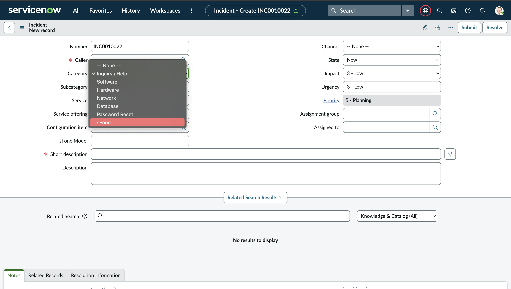
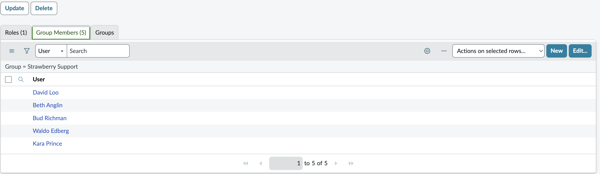
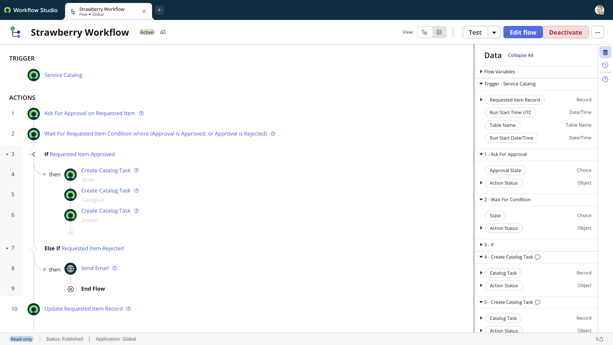
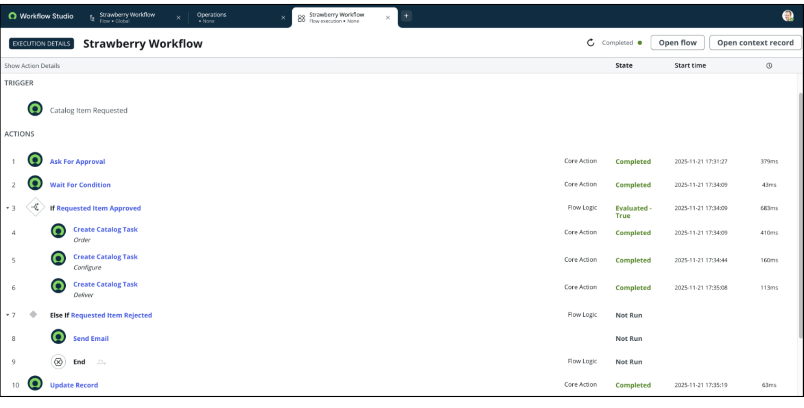
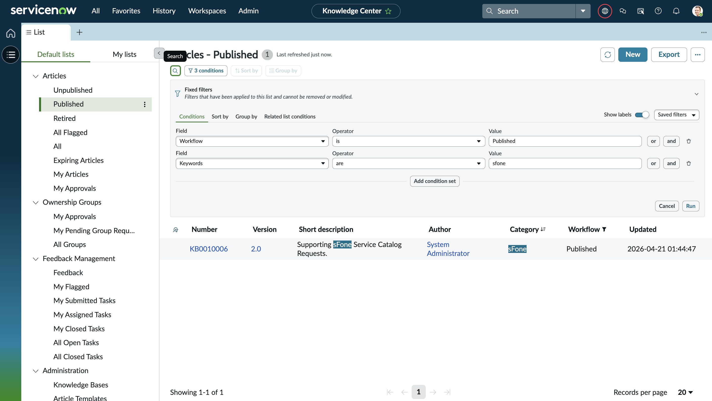
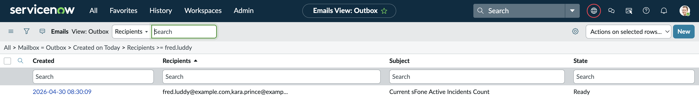
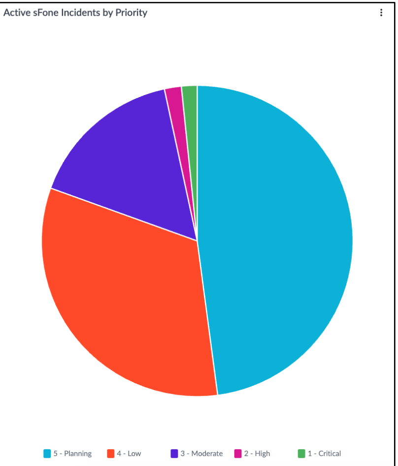

# ServiceNow Administration Fundamentals — Capstone Project
 
> As part of the **ServiceNow Administration Fundamentals** course, I completed a hands-on capstone that had me configure a ServiceNow instance from the ground up around a fictional product called the **Strawberry sFone**. Across six tasks, I touched everything from form configuration and user management to workflow automation, knowledge management, and analytics — building out a fully functional support ecosystem end-to-end.
 
---
 
## 📚 Skills I Developed
 
| Area | Skills |
|---|---|
| **Form Configuration** | Creating custom fields, configuring form views, adding choice values via Form Builder |
| **User Administration** | Creating user groups, adding members, assigning roles, setting manager hierarchies |
| **Service Catalog** | Importing catalog items via Update Sets, configuring catalog item records |
| **Workflow Automation** | Building flows in Workflow Studio with triggers, approvals, conditional logic, catalog tasks, and email actions |
| **Knowledge Management** | Creating KB categories and articles, applying role-based security |
| **Task Assignment** | Configuring Services and Service Offerings for automatic incident assignment |
| **Notifications** | Building email notifications with dynamic variables and dot-walking for recipients |
| **Analytics & Reporting** | Creating data visualizations, scheduling automated reports to stakeholder groups |
 
---
 
## 🏗️ Capstone Scenario
 
The capstone scenario puts you in the role of a ServiceNow admin for **Strawberry**, a company that just launched a new mobile device — the **sFone**. My job was to configure the platform to handle everything around it: support incidents, catalog requests, internal knowledge articles, automated assignments, critical alerts, and reporting. Each task built on the last, so by the end it all tied together into one cohesive setup.
 
---
 
## ✅ Task Breakdown
 
### Task 1 — Updated Incident Management
**Module Reference:** Configure Applications for Business
 
First thing I did was prep the Incident form to handle sFone-specific issues. I jumped into Form Builder and created a brand new **sFone Model** field (String type), then positioned it right below the Configuration Item field on the Default view. From there I right-clicked the Category field label and added **sFone** as a new choice option. To wrap it up, I submitted a test incident — caller Megan Burke, category sFone — just to confirm everything landed correctly on the form.
 

 
---
 
### Task 2 — Set Up User Administration
**Module Reference:** Configure Applications for Business
 
With the form sorted, I moved on to building out the support team. I created a new group called **Strawberry Support** nested under Service Desk, with Fred Luddy set as the manager. I then added four existing users to the group — Beth Anglin, Bud Richman, David Loo, and Waldo Edberg — and created a brand new user, **Kara Prince**, directly from the group record (which automatically enrolled her). Finally, I added the Manager field to the User form via Form Builder and assigned Fred Luddy as Kara's manager.
 
 
---
 
### Task 3 — Automated Service Catalog Fulfillment
**Module Reference:** Configure Self Service
 
This was the most involved task. I started by importing the Strawberry sFone catalog item into the instance using the **Update Set** process — uploaded the XML, previewed it, committed it, and confirmed the state hit Committed.
 
Then I built the **Strawberry Workflow** in Workflow Studio from scratch. Here's how I structured it:
 
- **Trigger:** Service Catalog
- **Step 1 — Ask for Approval:** Routed to the requester's manager using the data pill picker and dot-walking through `Requested Item → Requested for → Manager`
- **Step 2 — Wait for Condition:** Pauses the flow until the approval state hits either Approved or Rejected
- **If Approved:** Three sequential catalog tasks fire one after another — *Order* (Procurement), *Configure* (Software), *Deliver* (Service Desk) — each with the Wait checkbox ticked so they complete before the next one starts
- **Else If Rejected:** Fires a Send Email action to the requester's email (dot-walked), then hits an End Flow
- **Final Step:** Updates the Requested Item record State to **Closed Complete**
Once the flow was built I activated it, linked it to the Strawberry sFone catalog item under the Process Engine tab, then tested the whole thing by impersonating David Loo to place the order and Bud Richman to approve it. Closed all three tasks as the admin and confirmed the workflow hit Completed status.
 

 

**Completed**

 
---
 
### Task 4 — Populated the Knowledge Base
**Module Reference:** Configure Self Service
 
I enabled **Instant Publish** on the IT Knowledge Base so articles wouldn't sit in a draft state, then created a new **sFone** category. From there I wrote and published two articles:
 
- **Requester Article** — *"Requesting an sFone from the Service Catalog"* — walks users through finding and ordering the item. No role restriction, so anyone with IT KB access can read it.
- **Fulfiller Article** — *"Supporting sFone Service Catalog Requests"* — written for the Strawberry Support team with guidance on handling incoming requests. I added the Roles field to the article form via Form Builder and restricted it to the **itil** role so only fulfillers can see it.

 
---
 
### Task 5 — Enhanced Task Assignment and Alerting
**Module Reference:** Enable Productivity
 
I set up automatic incident assignment so agents wouldn't have to manually set the assignment group every time. I created a **Telephone Services** service (Support Group: Service Desk), then added a **Strawberry sFone** service offering under it (Support Group: Strawberry Support). Now whenever an incident comes in with the Strawberry sFone service offering selected, the assignment group auto-populates to Strawberry Support — no manual input needed.
 
Then I built a **P1 sFone Incident** email notification that fires when all three conditions are met: Category = sFone, Priority = 1 – Critical, and Assignment Group = Strawberry Support. For recipients I dot-walked through `Assignment Group → Manager` so the alert goes straight to Fred Luddy. The email subject dynamically pulls the incident number using `${number}`, and the body includes opened date, opened by, and short description as variables.
 
I tested it by creating a Priority 1 sFone incident for Kara Prince with Urgency and Impact both set to High — the assignment group auto-populated and the notification showed up in the outbox.
 
 
---
 
### Task 6 — Built and Scheduled a Visualization
**Module Reference:** Enable Productivity
 
Last task was all about reporting. I went into the Analytics Center and created a **Pie Chart** visualization called *"Active sFone Incidents by Priority"* — sourced from the Incident table, filtered to Category = sFone, and grouped by Priority so the team can see at a glance where incidents are stacking up.
 
Once the chart was built, I scheduled it to automatically email the **Strawberry Support** group daily at 08:30 with the subject *"Current sFone Active Incidents Count"* and a short intro message pointing them to their 9:00 incident review meeting.
 
 
---
 
## 🛠️ Platform
 
- **ServiceNow** Personal Developer Instance (PDI)
- Course: *ServiceNow Administration Fundamentals*
- © 2025 ServiceNow, Inc.